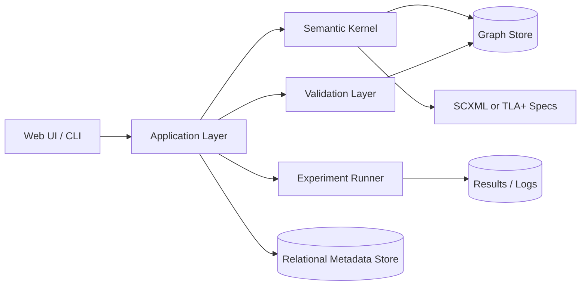
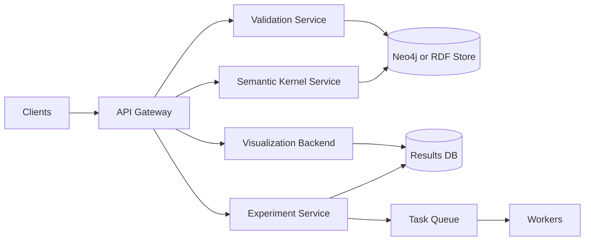
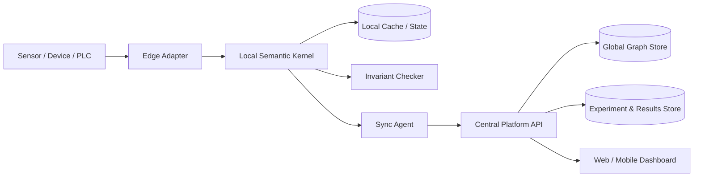

# Аналитический отчет по программной реализации темы композиционной вычислительной модели для параметризованных информационных объектов

## Исполнительное резюме

Из загруженного индивидуального плана аспиранта следует, что исследовательская тема сформулирована как **«Исследование и программная реализация вычислительной модели композиционного типа для параметризованных информационных объектов»**. В документе также прямо заявлены: композиционная модель с параметризуемыми концептами, управляющий семантический граф, поддержка переходных и устойчивых режимов, денотационная интерпретация вычислений, а в программной части — минимальное ядро среды, интерпретатор семантического графа, ввод концептов и параметров, правила переходов, механизмы наблюдения и визуализация. Это означает, что программная реализация должна проектироваться не как «обычное CRUD-приложение», а как **исследовательская программная платформа**, в которой есть формальная семантика, механизм композиции, слой верификации и экспериментальный контур. fileciteturn0file0

Поскольку в исходной постановке **не зафиксирована прикладная предметная область**, ниже предлагается доменно-нейтральное ядро и несколько вариантов надстроек: для семантической интеграции данных, когнитивного/документного моделирования и цифрового двойника/edge-сценариев. С теоретической точки зрения наиболее естественный фундамент здесь образуют денотационная семантика и domain theory, композиционная спецификация вычислительных конструкций, модели реактивных систем и иерархических автоматов, а также графовые модели представления знаний — RDF/OWL/SPARQL/SHACL и, как альтернативная инженерная ветка, property graph с формальной семантикой Cypher. Для строгой проверки инвариантов и переходов уместно дополнительно использовать TLA+/PlusCal или SCXML-представление автомата. citeturn13search2turn13academia50turn0academia60turn4search0turn6search3turn3search6turn0search0turn1search1turn3search0turn5academia60turn21search0turn21search5

Для горизонта **двух–трех месяцев** наиболее рациональным является не полный набор разнородных приложений сразу, а **эволюционный трек**:  
сначала — библиотека/ядро семантической машины и CLI/лабораторный стенд, затем — веб-консоль с визуализацией и экспериментами, и только после этого — мобильный клиент либо edge/embedded-адаптер. Архитектурно на старте оптимален **модульный монолит с отделяемым ядром**, потому что он позволяет быстро формализовать модель, построить экспериментальный контур и не потерять возможность последующего выделения ядра в сервис или SDK. Контейнеризация Docker и, при необходимости, оркестрация Kubernetes хорошо поддерживают такой путь разворачивания; FastAPI, React, Apache Jena/Fuseki, Neo4j, PostgreSQL и GitHub Actions дают достаточно зрелую и официально документированную технологическую основу для пилота. citeturn8search2turn8search0turn10search6turn11search0turn17search2turn17search1turn7search2turn7search1

Итоговая практическая рекомендация такова: **основным артефактом диссертационной работы должен стать семантический движок плюс экспериментальная платформа**, а не только пользовательский интерфейс. Тогда любая оболочка — PoC, web, desktop/CLI, mobile, edge — становится лишь формой применения одного и того же исследовательского ядра. Это лучше соответствует и тексту загруженного плана, и классической логике исследований в формальных моделях и языках спецификации. fileciteturn0file0 citeturn21search3turn21search11turn5academia63

## Исходная постановка и рабочие допущения

Содержательно тема из файла описывает систему, в которой есть:  
**параметризованные концепты**, **управляющий семантический граф**, **переходные и устойчивые режимы**, **денотационная интерпретация**, а также **программная среда для вычислений и трансформаций**. Для программной реализации это удобно интерпретировать так: есть объект знания или информационный объект, который описывается не только данными, но и контекстом, параметрами, ограничениями, допустимыми переходами и вычислимыми производными состояниями. В такой трактовке ядро реализации оказывается близко и к формальным спецификациям реактивных систем, и к knowledge-graph/ontology-стеку. fileciteturn0file0 citeturn4search0turn6search3turn3search6turn0search0turn3search0

Ниже я исхожу из следующих **явно объявленных допущений**. Они не противоречат загруженному документу, но закрывают пробелы, которые в нем пока еще не специфицированы.

| Параметр постановки | Что известно | Рабочее допущение для проектирования |
|---|---|---|
| Предметная область | Не зафиксирована | Домен-нейтральное ядро + доменные адаптеры |
| Тип графа | Указан «управляющий семантический граф» | Возможны два профиля: RDF/OWL/SHACL/SPARQL или property graph/Cypher |
| Формальная семантика | Указана денотационная интерпретация | Ядро задается как отображение синтаксических/структурных конструкций в вычислимые состояния и переходы |
| Режимы работы | Указаны устойчивые и переходные режимы | Используется модель состояний, событий и инвариантов |
| Планируемая программа | Есть интерпретатор, правила переходов, наблюдение, визуализация | Первичный deliverable — semantic kernel + experiment harness + visualization |
| Масштаб внедрения | Не зафиксирован | Сначала лабораторный/пилотный масштаб, затем масштабирование |

На уровне модели удобно ввести такую рабочую структуру **параметризованного информационного объекта**:  
`Объект = (идентичность, тип, атрибуты, параметры контекста, связи, ограничения, денотация, история переходов, объяснение)`.

Эта структура хорошо укладывается и в RDF-граф как набор троек с онтологией и SHACL-ограничениями, и в property graph как узлы, ребра и свойства; при этом переходы могут быть выражены через state machine/SCXML-представление или через формальную спецификацию операций в TLA+/PlusCal. RDF и OWL задают стандартный каркас семантического представления, SPARQL — запросы и преобразования графа, SHACL — валидацию и ограничения, SCXML — исполнимую модель состояний и переходов, а TLA+ — формальную проверку инвариантов и шагов системы. citeturn3search6turn0search0turn1search1turn3search0turn6search3turn21search0turn21search5

Практически это означает, что **ядро исследования** можно построить как композицию трех слоев:

| Слой | Назначение | Формальный прообраз |
|---|---|---|
| Семантический | Что объект «значит» и какие инварианты соблюдаются | Денотационная семантика, ontology semantics |
| Операционный | Как объект меняется при событиях и правилах | Transition systems, statecharts, SCXML |
| Инженерный | Как это хранится, исполняется и тестируется | Graph DB / triple store / API / CI/CD |

## Варианты программной реализации

Из текста загруженного плана видно, что минимальный состав программной среды уже намечен: интерпретатор семантического графа, ввод концептов и параметров, правила переходов, механизмы наблюдения, поддержка трансформаций и визуализация. Поэтому ниже варианты реализации различаются не по «сути модели», а по тому, **какая упаковка, аудитория и форма эксплуатации** будут у исследовательского ядра. fileciteturn0file0

### Детализированные варианты проектов

| Тип проекта | Цель | Ключевые функции | Целевая аудитория | Ожидаемые результаты | Преимущества | Ограничения |
|---|---|---|---|---|---|---|
| **PoC-прототип семантической машины** | Быстро подтвердить жизнеспособность модели | DSL/JSON/YAML-описание концептов, параметров и правил; интерпретатор графа; трассировка переходов; экспорт логов эксперимента | Научный руководитель, исследователь, внутренние рецензенты | Проверка формализма, первые эксперименты, реплицируемые сценарии | Максимальная скорость, низкий порог изменений, хорош для статьи | Слабая UX-оболочка, ограниченная интеграция |
| **Веб-приложение исследовательской платформы** | Сделать модель наблюдаемой и доступной для сценарных экспериментов | Визуальный редактор графа; запуск сценариев; просмотр переходов и инвариантов; журнал объяснений; сравнение базовых и экспериментальных конфигураций | Исследователи, аналитики, демонстрация на кафедре/конференции | Полноценная пилотная среда и прикладной демонстратор | Лучший баланс между наглядностью и воспроизводимостью | Требует front-end и DevOps-усилий |
| **Десктоп/CLI-лаборатория** | Обеспечить строгий контроль над экспериментами и пакетный запуск | CLI-команды для загрузки модели, выполнения шага, пакетных прогонов, профилирования, валидации, экспорта протокола | Исследователь, QA, рецензенты, CI/CD | Реплицируемый экспериментальный контур, удобный для benchmark-ов | Отлично подходит для автоматизации и статейных экспериментов | Менее удобен для демонстрации нетехнической аудитории |
| **Мобильное приложение-наблюдатель** | Дать мобильный доступ к состояниям, уведомлениям и результатам экспериментов | Просмотр графа и состояния; алерты по нарушениям инвариантов; карточка объекта; история событий | Руководитель проекта, демонстрации, полевые сценарии | Поддержка наблюдения и демонстрации «вживую» | Хорошо работает как витрина и для edge/IoT-сюжетов | Не должно быть первичным deliverable без готового ядра |
| **Библиотека или фреймворк** | Превратить исследование в расширяемый reusable-core | API ядра; модель типов; интерфейсы хранения; плагины правил; верификация ограничений; SDK для доменных модулей | Разработчики, исследователи, будущие интеграторы | Долговечный основной артефакт диссертации | Наилучшая переносимость и научная ценность | Требует дисциплины API и документации |
| **Интеграция с аппаратурой и edge-узлом** | Проверить модель в реактивной среде с реальными событиями | Адаптеры датчиков/PLC/шины сообщений; локальная интерпретация правил; синхронизация состояний с сервером; журнал телеметрии | Цифровые двойники, IoT, киберфизические макеты | Практическая демонстрация устойчивости при изменяющихся параметрах | Сильнейший прикладной эффект и демонстрационная ценность | Существенно выше риск, зависимость от железа и среды |

### Сравнение по инженерным критериям

Оценки ниже — **оценка автора** для проекта в горизонте 2–3 месяцев при маленькой R&D-команде.

| Вариант | Сложность | Время разработки | Стоимость | Масштабируемость | Риск |
|---|---:|---:|---:|---:|---:|
| PoC-прототип | Низкая–средняя | 3–5 недель | Низкая | Средняя | Низкий |
| Web-платформа | Средняя | 6–10 недель | Средняя | Высокая | Средний |
| Desktop/CLI | Низкая–средняя | 4–6 недель | Низкая–средняя | Средняя | Низкий |
| Мобильный клиент | Средняя | 5–8 недель поверх готового API | Средняя | Средняя | Средний |
| Библиотека/SDK | Средняя | 5–8 недель | Средняя | Очень высокая | Средний |
| Edge/embedded-интеграция | Высокая | 8–12 недель | Средняя–высокая | Высокая | Высокий |

### Рекомендуемая последовательность

Если задача — получить и **научный**, и **инженерный** результат, то оптимальная последовательность выглядит так:  
**библиотека/ядро → CLI/PoC → web-платформа → mobile или edge-адаптер**. Такой порядок соответствует и загруженному плану, где сначала фигурируют формализация, минимальное ядро, правила переходов и механизмы наблюдения, а затем визуализация и прикладные модули. fileciteturn0file0

С практической точки зрения в первые 2–3 месяца я бы рекомендовал **комбинированный deliverable**:

1. **Библиотека ядра** как основной научный артефакт.  
2. **CLI/лабораторный стенд** как средство репликации экспериментов.  
3. **Веб-консоль** как средство визуализации, демонстрации и интерактивной работы.

Мобильный клиент и hardware-in-the-loop лучше оставить как **дополнительные ветки**, если по ходу проекта станет понятна прикладная область и появится инфраструктура реального пилота. Эта стратегия хорошо согласуется с тем, что в официальных документах React, Flutter, Kotlin Multiplatform, FastAPI, Jena и Neo4j рассматриваются как зрелые платформы для соответствующих типов оболочек и сервисов. citeturn11search0turn10search0turn8search4turn10search6turn17search2turn17search1

## Теоретическая база и формальные основания

Теоретическая база для такой темы должна быть не «декоративной», а **прямо переводимой в код**. В вашем случае теория нужна минимум для четырех вещей:  
для задания смысла вычислений,  
для задания допустимых переходов между состояниями,  
для формализации ограничений и проверок,  
и для получения воспроизводимых метрик эксперимента. Именно поэтому здесь лучше опираться не только на общие идеи “graph-based modeling”, но и на формальные традиции денотационной семантики, реактивных систем, онтологического моделирования и формальной верификации. citeturn13academia50turn0academia60turn4search0turn0search0turn3search0turn21search3

### Ключевые теории, модели и алгоритмические основания

| Теория или модель | Зачем она нужна в вашей теме | Что она дает в реализации | Ключевые источники |
|---|---|---|---|
| **Денотационная семантика и domain theory** | Задает математическое значение конструкциям модели, а не только пошаговое исполнение | Формальное отображение «концепт/композиция/переход» → «значение/состояние/результат», работа с фиксированными точками и рекурсией | Dana Scott, *Outline of a Mathematical Theory of Computation*; Cartwright et al., *Domain Theory: An Introduction* citeturn13search2turn13academia50 |
| **Композиционная спецификация вычислительных конструкций** | Поддерживает главный тезис темы — вычислительная модель композиционного типа | Позволяет строить сложные вычисления как композицию малых семантически определенных операторов | Mosses, *Fundamental Constructs in Programming Languages* citeturn0academia60 |
| **Statecharts и реактивные системы** | Нужны для устойчивых/переходных режимов и иерархии состояния | Иерархические состояния, параллелизм, события, правила переходов | Harel, *Statecharts: a visual formalism for complex systems*; W3C SCXML citeturn4search0turn6search3 |
| **RDF/OWL/SPARQL/SHACL** | Нужны для семантического графа, формализации знаний, запросов и ограничений | Стандартное графовое представление, онтологии, запросы и формальная валидация графа | W3C RDF 1.1, OWL 2, SPARQL 1.1, SHACL citeturn3search6turn0search0turn1search1turn3search0 |
| **Property graph и формальная семантика Cypher** | Альтернатива RDF-стеку, если важнее инженерная простота и traversal-запросы | Практичная работа с узлами/ребрами/свойствами и формально описанный read-only core языка запросов | Neo4j docs; Francis et al., *Formal Semantics of the Language Cypher* citeturn17search1turn5search0turn5academia60 |
| **Формальная спецификация и model checking** | Нужны для доказуемости инвариантов и корректности переходов | Проверка safety/liveness, трассы ошибок, инварианты над переходами | Lamport TLA+ home/tools; TLAPS papers citeturn21search0turn21search5turn5academia61turn5academia63 |
| **Графовые преобразования и параметризованная верификация** | Подходят, если переходы описываются как переписывание графа | Построение правил трансформации и анализ достижимости/корректности | Delzanno & Stückrath, parameterized verification of graph transformation systems citeturn12academia52 |

### Теоретическая интерпретация вашей модели

Наиболее сильная и при этом практически реализуемая трактовка темы такова:

- **Параметризованный концепт** — это типизированный объект со значением, параметрами среды и ограничениями.
- **Композиционная единица** — это оператор, который строит новый объект, состояние или значение из других объектов.
- **Управляющий семантический граф** — это граф зависимостей и переходов, который задает не только связи между объектами, но и допустимую динамику изменения состояний.
- **Денотация** — это отображение синтаксически заданной конфигурации в математически определенное состояние/значение.
- **Переходный режим** — это изменение конфигурации графа и/или параметров до достижения нового устойчивого состояния.
- **Устойчивый режим** — это состояние, в котором выполнены инварианты и не требуется дальнейшее применение правил стабилизации.

Именно такая интерпретация хорошо «сшивает» domain-theoretic традицию, иерархические автоматы Harel/SCXML, RDF/OWL/SHACL-ограничения и формальные спецификации TLA+. citeturn13academia50turn4search0turn6search3turn3search0turn21search3

### Практический вывод из теории

Если цель диссертации — подчеркнуть **семантическую строгость и интероперабельность**, то базовый стек следует строить вокруг **RDF/OWL/SPARQL/SHACL** с Jena/Fuseki. Если же цель — быстрее получить рабочую инженерную платформу с наглядными обходами графа и хорошей UX-скоростью, то разумнее строить ядро на **property graph + Cypher**, а онтологические и валидационные элементы держать поверх него или параллельно. Гибридный путь тоже возможен: исследовательское ядро хранит абстрактную внутреннюю модель, а адаптеры сериализуют ее в RDF или в property graph в зависимости от эксперимента. W3C-стек и Apache Jena покрывают формальные знания, запросы, inference и SHACL-валидацию; Neo4j и Cypher удобны для инженерной эксплуатации и path-centric аналитики. citeturn17search2turn17search4turn17search1turn5search0turn5academia60

## Архитектурные варианты

Для вашей темы уместно рассматривать три архитектурных класса: **модульный монолит**, **микросервисную платформу** и **edge/embedded-вариант**. Все три жизнеспособны, но они решают разные задачи. Для раннего научного этапа критично, чтобы архитектура не мешала быстро менять формализм, правила переходов и формат хранения экспериментальных данных. Поэтому важнее не “самая масштабируемая” архитектура, а та, которая минимизирует стоимость итерации над моделью. Docker хорошо поддерживает контейнерный жизненный цикл приложения, а Kubernetes — переносимое и декларативное управление контейнеризированными сервисами, если позже вам понадобится масштабирование. citeturn8search2turn8search0

### Модульный монолит с отделяемым ядром

Это лучший стартовый вариант для исследовательской работы. Ядро модели, API, валидатор, планировщик экспериментов и визуализация находятся в одном приложении, но разделены по модулям и контрактам. Такой вариант ускоряет разработку и снижает накладные расходы на эксплуатацию, при этом не закрывает путь к будущему выделению отдельных сервисов. FastAPI документирует простой путь развертывания web API, PostgreSQL — надежный relational core, а Neo4j или Jena/Fuseki могут использоваться в качестве семантического/графового хранилища. citeturn10search6turn7search2turn17search1turn17search2

### Микросервисная платформа

Микросервисы уместны, если вы заранее знаете, что потребуется несколько независимых контуров: отдельный сервис интерпретации, отдельный сервис валидации, отдельный сервис экспериментов, отдельный UI-backend, очереди задач и горизонтальное масштабирование. Но на этапе формализации они часто затрудняют работу: меняется семантика — приходится менять несколько контрактов, схемы сообщений и deployment-процедуры. Их имеет смысл включать позже, когда структура ядра стабилизируется и появляется реальная потребность в независимом масштабировании. Orchestration-сценарии Kubernetes и фоновые очереди Celery/Redis хорошо подходят для такого роста. citeturn8search0turn18search4turn18search2

### Edge или embedded-архитектура

Этот вариант особенно силен для цифровых двойников, IoT и сценариев с быстро меняющимися параметрами среды. Формально он хорошо соответствует теме, потому что там присутствуют переходные режимы, реактивность и необходимость устойчивой интерпретации изменяющихся данных. На edge-узле можно держать локальный интерпретатор правил и минимальное состояние, а в центре — полный граф знаний, историю, UI, эксперименты и аналитическую верификацию. В таких системах SCXML/TLA+ удобно использовать для описания и проверки автоматной части, а графовое или RDF-хранилище — для глобальной семантики. citeturn6search3turn21search3turn21search5turn17search2turn17search1

### Сравнение архитектур

| Архитектура | Когда выбирать | Плюсы | Минусы | Рекомендация для диссертации |
|---|---|---|---|---|
| Модульный монолит | Формализм еще уточняется | Быстрая итерация, простота дебага, минимальные накладные расходы | Масштабирование грубее | **Базовый выбор для первых 2–3 месяцев** |
| Микросервисы | Стабильные контракты и рост нагрузки | Независимое масштабирование, изоляция подсистем | Сложность DevOps и трассировки | Выделять после стабилизации ядра |
| Edge/embedded | Реальные датчики, реактивность, digital twin | Сильный прикладной эффект, локальная автономность | Зависимость от железа и сети | Делать как демонстрационный extension |

### Архитектурная рекомендация

Для вашего исследования я бы рекомендовал **модульный монолит с библиотечным ядром**, а не “чистый монолит” в плохом смысле и не ранние микросервисы. Это дает три преимущества. Во-первых, формальная часть остается в одном месте и не размывается между сервисами. Во-вторых, CLI, web и mobile могут использовать одно и то же ядро через единые контракты. В-третьих, если позже потребуется промышленный режим, отдельные части можно выделить в сервисы без переписывания модели. citeturn10search6turn17search2turn17search1turn8search2turn8search0

## План реализации, спринты, ресурсы и бюджет

Ниже дан план для **проекта длительностью 10–12 недель**, ориентированного на научный пилот: ядро модели, валидируемый экспериментальный контур, web-консоль и минимальный пакет документации/публикационных материалов. Этот план логически продолжает тот путь, который уже намечен в загруженном документе: формализация концептов, вычислительное ядро, тестирование, визуализация, прикладная адаптация и анализ результатов. fileciteturn0file0

### Этапы, задачи и критерии готовности

| Этап | Содержание работ | Срок | Человеческие ресурсы | Технические ресурсы | Критерий готовности |
|---|---|---:|---|---|---|
| Формализация модели | Уточнить сущности, параметры, типы переходов, инварианты, DSL и формат сценариев | 1–2 недели | научный лидер, архитектор, backend | репозиторий, диаграммы, ADR | Есть формальная спецификация v0 и 10–15 эталонных сценариев |
| Ядро семантической машины | Реализация типов, композиции, интерпретатора переходов, журналирования, объяснений | 2–4 недели | backend, архитектор | Python/Java runtime, unit tests | Выполняются эталонные сценарии, есть трасса переходов |
| Хранилище и валидация | Интеграция со store, constraints, запросы, импорт/экспорт | 2–3 недели | backend, data engineer | Neo4j или Jena, PostgreSQL | Проходят проверки инвариантов и запросы к графу |
| CLI и экспериментальный контур | Batch-run, benchmark runner, экспорт отчетов, метрики | 1–2 недели | backend, QA/data | pytest, MLflow optional | Один сценарий запускает полный эксперимент без ручных шагов |
| Web-консоль и визуализация | Редактор/просмотр графа, карточка объекта, запуск сценария, просмотр логов | 2–3 недели | frontend/fullstack | React, API, визуализация | Демонстрация от загрузки модели до просмотра результата |
| Верификация и тесты | TLA+/SCXML-спеки ключевых переходов, нагрузочные и регрессионные тесты | 1–2 недели | архитектор, QA, backend | TLA+ Toolbox, Playwright, pytest | Инварианты проверяются, regression suite стабилен |
| Подготовка материалов | README, спецификация API, экспериментальный протокол, презентация/статья | 1 неделя | вся команда | docs pipeline | Есть воспроизводимый архив проекта и отчет |

### Спринтовое расписание

Ниже — практическое расписание на **шесть двухнедельных спринтов**.

| Спринт | Цель спринта | Основные deliverables |
|---|---|---|
| Спринт альфа | Формализм и эталонные сценарии | Модель данных, glossary, DSL v0, диаграммы, baseline-сценарии |
| Спринт бета | Ядро интерпретатора | semantic kernel v0, unit tests, лог переходов |
| Спринт гамма | Хранилище и ограничения | Graph persistence, validator, query layer |
| Спринт дельта | CLI и экспериментальный harness | batch runner, benchmark scripts, export reports |
| Спринт эпсилон | Web UI и визуализация | web-console v0, visual graph, scenario launch |
| Спринт дзета | Верификация, hardening, отчетность | regression suite, TLA+/SCXML specs, demo, отчет |

### Команда и трудозатраты

Ниже — **базовый состав** команды для узкого исследовательского пилота.

| Роль | Нагрузка | Ориентир по часам | Основная зона ответственности |
|---|---:|---:|---|
| Научный лидер / системный архитектор | 0.3–0.5 FTE | 100–140 ч | Формализм, архитектура, критерии экспериментов |
| Backend / knowledge engineer | 1.0 FTE | 280–360 ч | Ядро модели, API, графовые запросы, валидация |
| Frontend / fullstack | 0.5–0.8 FTE | 140–220 ч | Web-консоль, визуализация, UX исследовательского стенда |
| QA / data / experiment engineer | 0.4–0.6 FTE | 120–180 ч | Тесты, benchmark-и, метрики, воспроизводимость |
| DevOps | 0.1–0.2 FTE | 40–70 ч | CI/CD, контейнеры, dev/stage окружения |

### Технические ресурсы

| Категория | Минимум для пилота | Предпочтительно |
|---|---|---|
| Машины разработчиков | 16 ГБ RAM, 4+ CPU | 32 ГБ RAM |
| Dev/stage сервер | 4 vCPU, 8–16 ГБ RAM | 8 vCPU, 16–32 ГБ RAM |
| Хранилище | PostgreSQL + Neo4j **или** Fuseki/Jena | PostgreSQL + Neo4j + object storage |
| CI/CD | GitHub Actions | GitHub Actions + self-hosted runners |
| Мониторинг | Базовые логи и healthchecks | Grafana + metrics/log dashboards |

Официальные документы PostgreSQL, Docker, Kubernetes, GitHub Actions и Grafana подтверждают зрелость этих компонентов для документации, упаковки, оркестрации, автоматизации workflow и наблюдаемости. citeturn7search2turn8search2turn8search0turn7search1turn18search1

### Бюджетная оценка

Ниже — **оценка автора** для рынка внутренней R&D-разработки при условных blended rates, а не коммерческая смета подрядчика. Явные допущения: 10–12 недель, узкий пилот, без дорогостоящего железа, без НДС и без длительной эксплуатации.

| Сценарий | Состав | Бюджет |
|---|---|---:|
| Узкий PoC | ядро + CLI, без полноценного UI | **0.9–1.6 млн ₽** |
| Исследовательский пилот | ядро + CLI + web-консоль + тесты | **2.6–3.6 млн ₽** |
| Расширенный пилот | исследовательский пилот + mobile или edge-модуль | **3.4–5.0 млн ₽** |

Если выбирать **одну** реалистичную цифру для диссертационного пилота, я бы ориентировался на **около 3.0 млн ₽ ± 20%**. Это покрывает ядро, визуализацию, тестовый контур и базовую верификацию.

### Критерии инженерной и научной готовности

| Категория | Критерий |
|---|---|
| Функциональная готовность | Система загружает модель, выполняет переходы, валидирует инварианты, визуализирует результат |
| Научная готовность | Есть формализованные гипотезы, baseline-сравнение, воспроизводимые сценарии и протокол эксперимента |
| Инженерная готовность | Есть unit/integration/e2e tests, CI/CD pipeline, контейнерный запуск, версионируемая документация |
| Демонстрационная готовность | За 5–7 минут можно показать полный сценарий от модели до отчета |
| Публикационная готовность | Есть схема архитектуры, таблица экспериментов, метрики, ограничения и угрозы валидности |

## Методология исследования, эксперименты и валидация

Для такой темы исследование не должно ограничиваться “мы написали прототип и он работает”. Нужна **валидируемая методология**, где сравниваются альтернативные способы моделирования, а результаты выражаются в измеримых величинах: корректность, устойчивость, адаптивность, производительность и объяснимость. Это соответствует и содержанию вашего плана, где отдельно указаны анализ литературы, построение модели, реализация среды, оценка эффективности и описание наблюдаемых эффектов при изменении параметров и переходах в графе. fileciteturn0file0

### Гипотезы исследования

| Гипотеза | Смысл | Как проверять |
|---|---|---|
| **H1** | Композиционная модель уменьшает число семантических противоречий по сравнению с baseline-моделью | Сравнение числа нарушений ограничений и конфликтов состояний |
| **H2** | Параметризация концептов сокращает стоимость адаптации к изменению контекста | Измерение числа изменяемых правил/схем и времени перенастройки |
| **H3** | Управляющий семантический граф улучшает интерпретируемость переходов | Экспертная оценка объяснимости и полноты трассы решения |
| **H4** | Формальная спецификация инвариантов повышает надежность реализации | Доля ошибок, найденных до runtime, и число regression-defect-ов |
| **H5** | Выделенное ядро + оболочки не ухудшают критически производительность | p50/p95 latency, throughput, memory footprint |

### Метрики

| Метрика | Что измеряет | Тип |
|---|---|---|
| Constraint Satisfaction Rate | Доля состояний без нарушений SHACL/бизнес-инвариантов | Качество |
| Semantic Drift Incidents | Число случаев, когда при изменении параметров смысл объекта становится противоречивым | Качество |
| Convergence Time | Время выхода из переходного режима в устойчивое состояние | Динамика |
| Adaptation Cost | Число правил/типов/схем, которые нужно изменить при изменении контекста | Сопровождаемость |
| Explainability Completeness | Насколько полно система объясняет происхождение текущего состояния | Интерпретируемость |
| Query Latency p50/p95 | Время запросов и шагов интерпретации | Производительность |
| Throughput | Число обработанных событий/переходов в секунду | Производительность |
| Regression Failure Rate | Частота повторного появления дефектов после изменений | Надежность |

### Экспериментальный дизайн

Рационально сравнивать не “вашу систему против ничего”, а **три условия**:

| Условие | Описание |
|---|---|
| Baseline A | Реляционная или императивная модель с обычными таблицами и кодовыми правилами |
| Baseline B | Графовая модель без формальной денотационной прослойки |
| Candidate C | Ваша композиционная модель с параметризованными концептами и управляющим графом |

Эксперимент лучше строить на **трех классах сценариев**:

| Класс сценариев | Пример |
|---|---|
| Семантическая интеграция | Слияние источников с конфликтующими атрибутами и контекстами |
| Реактивный документооборот/knowledge workflow | Изменение статуса, контекста, приоритетов, связей и объяснений |
| Digital twin / event-driven scenario | Поток событий от устройств или симулятора, переводящих объект между режимами |

Такой дизайн позволяет показать, что предложенная модель не «подогнана» под один искусственный пример. Стандарты RDF/OWL/SPARQL/SHACL дают строгий каркас для сценариев семантической интеграции, а Statecharts/SCXML и TLA+ — для реактивных переходов и инвариантов. citeturn3search6turn0search0turn1search1turn3search0turn4search0turn6search3turn21search3turn21search5

### Сбор и анализ данных

Собирать стоит не только финальные метрики, но и **сырые артефакты эксперимента**:

| Данные | Зачем нужны |
|---|---|
| Трассы переходов | Для анализа поведения и объяснимости |
| Логи нарушений инвариантов | Для оценки устойчивости и качества модели |
| Времена запросов и шагов | Для performance-анализа |
| Версии модели и наборов параметров | Для воспроизводимости |
| Экспертные оценки и анкеты | Для интерпретируемости и usability |
| Артефакты запусков | Для сравнения конфигураций и regression analysis |

Если в проекте есть компонент обучения/оптимизации, удобно использовать MLflow Tracking для записи параметров, метрик, кода и артефактов эксперимента. citeturn15search2

### Статистические методы

Для производительности, устойчивости и пользовательских сравнений я рекомендую следующую схему:

| Ситуация | Метод |
|---|---|
| Сравнение двух независимых групп, распределение не гарантировано нормальным | Mann–Whitney U |
| Сравнение парных сценариев “до/после” или baseline/candidate на одном наборе задач | Парный t-test при нормальности, иначе Wilcoxon signed-rank |
| Оценка доверительных интервалов для метрик и разности метрик | Bootstrap CI, предпочтительно BCa |
| Планирование объема выборки | Power analysis через statsmodels |
| Интерпретация важности эффекта | Effect size + доверительный интервал, а не только p-value |

Официальная документация SciPy описывает `mannwhitneyu` как непараметрический тест для двух независимых выборок, а `bootstrap` — как средство вычисления доверительных интервалов статистики, по умолчанию поддерживающее BCa. Документация statsmodels показывает, как решать уравнение мощности теста для вычисления требуемого объема наблюдений. citeturn14search0turn15search0turn16search5turn16search8

### План экспериментов и тестовый набор

| Категория тестов | Набор кейсов | Что подтверждает | Критерий прохождения |
|---|---|---|---|
| Семантическая корректность | 20–30 эталонных моделей с ожидаемой денотацией | Что ядро интерпретирует модель как задумано | 100% совпадение по эталонам |
| Переходные режимы | Сценарии смены параметров, событий и контекста | Что система корректно проходит через нестабильные режимы | Нет недопустимых тупиков, инварианты соблюдены |
| Устойчивость | Повторный запуск одних и тех же сценариев при вариациях параметров | Что система приходит к допустимому устойчивому состоянию | Доля успешной стабилизации не ниже целевого порога |
| Адаптивность | Изменение схемы/контекста/правил | Что модель легко перенастраивается | Стоимость адаптации ниже baseline |
| Производительность | Нагрузки по числу объектов, ребер, событий | Что решение применимо не только на игрушечных данных | p95 latency и throughput в рамках SLA пилота |
| Объяснимость | Экспертная проверка трасс и объяснений | Что переходы интерпретируемы | Средний экспертный балл не ниже целевого |
| Регрессия | Повторный прогон полного набора после каждого изменения | Что исправления не ломают старые свойства | 0 критических regression failures |
| Интеграция | API, UI, storage, queue, sync | Что платформа работает как целое | Все интеграционные smoke tests green |
| E2E | Пользовательский сценарий “создать модель → запустить → получить отчет” | Что средство реально используемо | Сценарий проходит без ручного вмешательства |

### Угрозы валидности

Нужно заранее описать и ограничения исследования. Главные угрозы здесь обычно такие:  
узкая предметная область,  
слишком игрушечные данные,  
подмена семантической устойчивости удобством конкретной реализации,  
несправедливо слабый baseline,  
избыточно субъективная экспертная оценка объяснимости.  

Чтобы эти риски снизить, используйте **как минимум два baseline-а**, смешивайте синтетические и реальные/полуреальные сценарии, фиксируйте протоколы эксперимента в коде и держите весь regression и benchmark pipeline в CI. GitHub Actions как средство автоматизации workflow, pytest как фундамент тестового контура и Playwright как E2E-инструмент хорошо подходят для этой части процесса. citeturn7search1turn9search4turn11search2turn11search7

## Рекомендуемый стек и CI/CD контур

Технологический стек в такой работе должен выбираться не по моде, а по тому, насколько хорошо он обслуживает **формальную часть**, **экспериментальный контур** и **демонстрацию результатов**. Для web API FastAPI дает простой и хорошо документированный способ публикации сервиса; для фронтенда React обеспечивает развитую компонентную экосистему; для graph/semantic-части у вас есть два сильных официально документированных направления — Apache Jena/Fuseki для RDF/OWL/SPARQL/SHACL и Neo4j/Cypher для property graph; PostgreSQL закрывает реляционный и метаданный слой; Docker и Kubernetes покрывают упаковку и оркестрацию; GitHub Actions — автоматизацию CI/CD. citeturn10search6turn11search0turn17search2turn17search1turn7search2turn8search2turn8search0turn7search1

### Рекомендуемый стек по слоям

| Слой | Базовый выбор | Альтернатива | Когда выбирать альтернативу |
|---|---|---|---|
| Ядро семантики | Python typed core | Kotlin/JVM или Rust | Если требуется более жесткая типизация или высокая производительность |
| API | FastAPI | Spring Boot / Ktor | Если нужен JVM-first стек |
| Графовое хранилище | Neo4j | Apache Jena/Fuseki | Если приоритет — стандарты RDF/OWL/SHACL |
| Реляционный слой | PostgreSQL | SQLite для PoC | Только для сверхбыстрого локального старта |
| Background jobs | Celery + Redis | встроенные async jobs / Kafka later | Если нагрузка мала — можно начать без отдельной очереди |
| Web UI | React | Vue / Svelte | Если в команде другая экспертиза |
| CLI | Python + Typer/Rich | Rust CLI | Если нужен бинарный дистрибутив |
| Mobile | Flutter | Kotlin Multiplatform | Flutter — для скорости, KMP — если хотите native UI при общем logic layer |
| Formal verification | TLA+/PlusCal | SCXML + checker | TLA+ — для строгих инвариантов, SCXML — для исполнимой state-модели |
| Experiment tracking | MLflow при наличии ML/оптимизации | собственные JSON/CSV artifacts | Если контур проще и ML нет |

Выбор между Flutter и Kotlin Multiplatform зависит от цели мобильного компонента. Flutter прямо позиционируется как способ создавать multiplatform apps из одного codebase, а Kotlin Multiplatform — как способ делить логику между платформами, сохраняя нативный UI при желании. citeturn10search0turn8search4

### Контур качества кода и тестирования

Для короткого исследовательского проекта я бы рекомендовал такой минимальный quality stack:

| Задача | Инструмент |
|---|---|
| Управление Python-проектом и lockfile | `uv` |
| Unit/integration tests | `pytest` |
| E2E web tests | `Playwright` |
| Линтинг и форматирование | `Ruff` |
| Статическая типизация | `mypy` |
| CI/CD automation | `GitHub Actions` |
| Контейнеризация | `Docker` |
| Мониторинг пилота | `Grafana` |
| Хранение артефактов экспериментов | `MLflow` при необходимости |

Официальная документация uv подчеркивает управление зависимостями, lockfile и окружениями; pytest — масштабируемость от простых до сложных тестов; Playwright — кроссбраузерное e2e-тестирование; Ruff — быстрый linters/formatter; mypy — статическую проверку типов; GitHub Actions — автоматизацию workflow; Docker — контейнерную упаковку и переносимость; Grafana — визуализацию метрик, логов и трасс; MLflow — логирование параметров, метрик и артефактов запусков. citeturn19search0turn19search1turn9search4turn11search2turn20search1turn20search4turn7search1turn8search2turn18search1turn15search2

### Практический шаблон CI/CD

| Стадия пайплайна | Действие | Артефакт |
|---|---|---|
| Pre-commit | Ruff, mypy, быстрые unit tests | Проверенный commit |
| CI build | `uv sync`, запуск тестов, сборка контейнера | Docker image |
| Integration stage | Поднятие test stack, API tests, storage tests | Test report |
| E2E stage | Playwright сценарии, demo-flow smoke | E2E report |
| Benchmark stage | Ночной прогон performance/regression | Metrics snapshot |
| Release | Тег, image push, deploy в stage | Stage deployment |
| Research artifact | Экспорт сценариев, логов, отчетов, диаграмм | Реплицируемый пакет для статьи/защиты |

### Итоговая технологическая рекомендация

Если бы нужно было выбрать **одну конфигурацию “по умолчанию”** для вашей темы на 2–3 месяца, я бы предложил следующее:

- **Ядро**: Python + типизированные модели + библиотечный semantic kernel.  
- **API**: FastAPI.  
- **Хранилище**: PostgreSQL + Neo4j **или** PostgreSQL + Apache Jena/Fuseki, в зависимости от того, что вы хотите сильнее показать — инженерную graph-аналитику или стандартную семантическую интероперабельность.  
- **Интерфейсы**: CLI обязательно, web UI желательно, mobile позже.  
- **Формальная часть**: TLA+/PlusCal для инвариантов ключевых переходов; при необходимости — SCXML для исполнимой state-модели.  
- **Качество и эксплуатация**: uv, Ruff, mypy, pytest, Playwright, GitHub Actions, Docker.  

В диссертационном смысле это дает наилучший баланс между **формальной строгостью**, **практической реализуемостью** и **демонстрационной силой**. citeturn10search6turn17search1turn17search2turn21search0turn21search11turn6search3turn19search0turn20search1turn20search4turn9search4turn11search2turn7search1turn8search2